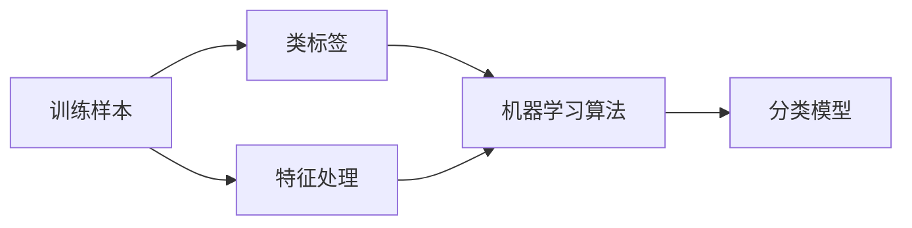

机器学习的代码实现主要在：

https://github.com/ChenZiHong-Gavin/data_science/blob/main/machine_learning/machine_learning.py

## 介绍

机器学习情感分析，即选出一部分积极情感的文本与消极情感的文本，用机器学习的方法进行训练，然后选出最佳的情感分类器，再通过这个情感分类器对其他所有文本进行积极和消极的分类。

机器学习的流程图：

训练

预测

## 机器学习进行情感分析的实现

### 人为处理语料库

需要人为处理一部分评论内容，给它们打上类型标签，作为训练样本。那么究竟多少训练样本是合适的呢？

根据假设检验中样本容量估计的公式：
$$
N=(\alpha \frac{\sigma}{e})^2
$$
N是所需样本数量，$\alpha$一定置信度所对应的的标准正态分布的个数，$\sigma$是样本的标准差， e是可接受的误差范围。

假设置信度为95%，则1.96是其所对应的标准正态分布的个数。

考虑到样本的标准差未知，而评论的情感分布一般是正态分布，将正向评论标记为0，负向评论标记为1，我们可以假设方差为0.5。误差大约是0.05

计算得
$$
N=(1.96)^2×\frac{0.5}{0.05^2}=768.32
$$
理论上，训练的样本数量是800。

为了获得更完善、更全面的结果和更准确的分类器，我们不妨取训练样本为100,500,800,1500,3000分别进行训练，观察其准确率，获得最优分类器。

### 特征提取

特征提取有多种方式：

* 单字作为特征
* 双字作为特征
* 单字加双字作为特征
* 使用分词后形成的词语作为特征

对于中文语义情感分析来说，毫无疑问，选取第四种——使用分词后形成的词语作为特征效果最佳。

### 特征降维

特征降维实际上是一个特征选择的过程。

特征数量过多，便可能存在许多不相关的特征，容易产生以下后果：

* 特征个数越多，分析特征、训练模型所需的时间就越长
* 特征个数越多，容易引起“维度灾难”，模型变得复杂，推广能力下降

特征选择 ( Feature Selection )也称特征子集选择( Feature Subset Selection , FSS ) ，或属性选择( Attribute Selection ) ，是指从全部特征中选取一个特征子集，使构造出来的模型更好。

特征选择可以使用多种算法，如：

* 皮尔逊相关系数

  检查数据集里目标和数值特征之间皮尔逊相关系数8的绝对值。根据这个准则保留前n个特征。

* 卡方分布

  该方法计算目标与数值变量之间的卡方度量分布，只选取卡方值最大的变量。

* 递归特征消除

  递归特征消除(RFE)的目标是递归地考虑越来越小的特征集来选择特征。首先，用初始特征集训练估计器，通过 coef_或者feature_importances_属性可以获得特征的重要性。然后，从当前的一组特性中删除最不重要的。该过程在修剪集上递归地重复，直到最终达到所需的要选择的特性数量。

卡方统计是特征选择方法中效果最好的算法之一，我们这里利用卡方统计选取信息量排名靠前n的词汇作为特征。

### 机器学习训练

1. 将特征转为训练时所需要的数据格式。
2. 划分训练集和测试集。
3. 选出最佳分类器。

### 分类器介绍

* LogisticRegression

  逻辑回归在文献中也称为对数回归，最大熵分类（MaxEnt）或对数线性分类器。在此模型中，使用logistic函数对描述单个试验可能的结果的概率进行建模 。

  Logistic函数（或者称为Sigmoid函数），函数形式为：
  $$
  g(z)=\frac{1}{1+e^{-z}}
  $$
  对于线性边界的情况，边界形式如下：
  $$
  z=\theta ^T x=\theta_0x_0+\theta_1x_1+…\theta_nx_n
  $$
  其中，训练数据为向量
  $$
  x=\begin{bmatrix}
  x_0,x_1,x_2…,x_n
  \end{bmatrix}^T
  $$
  最佳参数为
  $$
  \theta=\begin{bmatrix}
  \theta_0,\theta_1,\theta_2…,\theta_n
  \end{bmatrix}^T
  $$
  构造预测函数为
  $$
  h_{\theta}(x)=g(\theta^Tx)=\frac{1}{1+e^{-\theta^Tx}}
  $$
  其中$h_\theta(x)$的值有特殊的含义，它表示结果取1的概率，因此对于输入x分类结果为类别1和类别0的概率分别是：
  $$
  p(y=1|x;\theta)=h_\theta(x) \\
  p(y=0|x;\theta)=1-h_\theta(x) 
  $$

* SVM

   SVM（support Vector Mac）又称为支持向量机，是一种二分类的模型。当然如果进行修改之后也是可以用于多类别问题的分类。支持向量机可以分为线性核非线性两大类。其主要思想为找到空间中的一个更够将所有数据样本划开的超平面，并且使得样本集中所有数据到这个超平面的距离最短。

  SVM重点在于解决线性可分的问题。但很多时候，实际的问题是线性不可分的。SVM的思想就是将线性不可分的问题转化线性可分的问题。

  比如，在二维空间中，不得不用 $f(x)=ax^2+b+c$ 这个曲线将两类样本分开，而不是用一条直线将它们分开，这样就是一个线性不可分的问题。为了解决这个问题，我们可以使用换元法将即 
  $$
  x^2=y_1 , x=y_2
  $$
   , 这样一来替换为 
  $$
  z=a'y_1+b'y2+c' 
  $$
  

  这个线性方程，从而转换到了高维空间，代价是维度的增加引入了更多的变量。这样我们就完成了从线性不可分问题到线性可分问题的转换。

  在python的sklearn机器学习包中，SVM包含SVC，LinerSVC，NuSVC这三种分类

* 朴素贝叶斯

  贝叶斯分类算法是统计学是一种概率分类方法，朴素贝叶斯分类时贝叶斯分类中最简单的一种。利用贝叶斯公式根据某特征的先验概率计算出其后延概率，然后选择具有最大后延概率的类作为该特征所属的类。朴素贝叶斯，称之为“朴素”，是因为整个形式化过程只做了最原始、最简单的假设，具体假设如下：

  1. 特征之间相互独立
  2. 每个特征同等重要

  如果给定某由 
  $$
  B_1,B_2,…，B_n
  $$
  

  属性表示的数据点，那么该数据点来自类别$A_1$的概率是多少？数据点来自类别$A_2$的概率有事多少？可以应用贝叶斯准则得到：
  $$
  P(A_i|B_1,B_2,…,B_n)=\frac{P(B_1,B_2,…,B_n|A_i)P(A_i)}{P(B_1,B_2,…,B_n)}
  $$
  使用这些定义，可以定义贝叶斯分类准则：

  - 如果
    $$
    P(A_1|B_1,B_2,…,B_n)>P(A_2|B_1,B_2,…,B_n)
    $$
    则属于类别$A_1$

  - 如果
    $$
    P(A_1|B_1,B_2,…,B_n)<=P(A_2|B_1,B_2,…,B_n)
    $$
    

     则属于类别$A_2$

  使用贝叶斯准测，可以通过已知的三个概率值来计算未知的概率值。

  在sklearn中，我们用到了两种朴素贝叶斯分类方法，分别是MultinomialNB和BernoulliNB。

  MultinomialNB(多项式朴素贝叶斯)是先验为多项式分布的朴素贝叶斯。 它假设特征是由一个简单多项式分布生成的。多项分布可以描述各种类型样本出现次数的概率，因此多项式朴素贝叶斯非常适合用于描述出现次数的特征。该模型常用于文本分类，特征表示的是次数，例如某个词语的出现次数。

  BernoulliNB就是先验为伯努利分布的朴素贝叶斯。假设特征的先验概率为二元伯努利分布，在文本分类中 ，就是一个特征有没有在一个文档中出现。

### 最佳分类器

使用二八原则，将已经分类的样本的80%划分为训练集，20%划分为测试集，通过比较准确度score，寻找最佳特征维度与最佳分类算法。

每次结果经过多次计算取平均值，表格如下。

| 分类算法\特征维度  | 50       | 100      | 200      | 500      | 800      | 1500     |
| ------------------ | -------- | -------- | -------- | -------- | -------- | -------- |
| LogisticRegression | 0.825242 | 0.824560 | 0.863049 | 0.857777 | 0.871964 | 0.868817 |
| SVC                | 0.815534 | 0.815789 | 0.886302 | 0.846666 | 0.838852 | 0.810752 |
| LinerSVC           | 0.794176 | 0.815789 | 0.873385 | 0.831111 | 0.854304 | 0.840860 |
| NuSVC              | 0.812297 | 0.807017 | 0.886305 | 0.851111 | 0.836644 | 0.819355 |
| MultinomialNB      | 0.815534 | 0.824561 | 0.847547 | 0.871111 | 0.883002 | 0.873119 |
| BernoulliNB        | 0.818750 | 0.846147 | 0.860465 | 0.873333 | 0.875873 | 0.838709 |

我们可以看出，当分类器为NuSVC，特征维度为200时，预测准确率最高。
